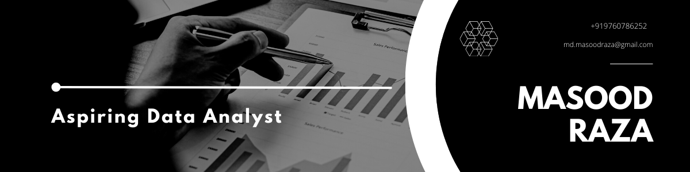

  

<!-- Typing Animation -->

# Hi there 👋, I'm Masood Raza  

📊 **Aspiring Data Analyst | Statistics & Operations Research Enthusiast**  

I’m passionate about uncovering insights from data, managing uncertainty, and helping organizations make informed, data-driven decisions. With a strong foundation in **statistics**, hands-on experience in **Python, SQL, and R**, and proven problem-solving skills, I strive to bridge the gap between raw data and meaningful business solutions.  

---

## 🔹 About Me  
- 🎓 Master of Science in **Statistics** from **Aligarh Muslim University (CGPA: 8.29)**  
- 📈 Experienced as a **Subject Matter Expert (Statistics)** at Chegg & Course Hero  
- 🧑‍💻 Solved **3000+ statistical problems** with 95%+ accuracy and high learner satisfaction  
- 🔬 Passionate about **statistical modeling, data visualization, and applied research**  
- 🌍 Love exploring the intersection of **data, sustainability, and decision-making**  

---

## 🛠️ Technical Skills  

  
  
  
  
  

**Statistical Techniques:** Regression, Hypothesis Testing, ANOVA, Multivariate Analysis, Time Series, Experimental Design  
**Soft Skills:** Analytical Thinking, Communication, Problem-Solving, Collaboration  

---

## 📂 Projects  

### 🌳 Forest Cover Analysis of Indian States  
- Analyzed **forest cover data** of 35+ states/UTs using ISFR & Indiastat  
- Visualized trends in R and identified correlations (e.g., forest area vs. population: r = 0.24)  
- Provided insights on sustainability and human-forest interaction  

### 🩺 Statistical Analysis of Family Health Data  
- Analyzed **NFHS-4 hypertension data** for 19 districts in Uttar Pradesh  
- Applied **Z-tests, chi-square, and logistic regression**  
- Found higher prevalence in males, age/religion associations, and gaps in **SDG-3 (Good Health)** targets  

---

## 🎓 Certifications  
- 📘 **The Complete SQL Bootcamp** – Udemy  
- 📊 **Statistics & Optimization Techniques Using Software Packages** – AMU  

---

## 🌱 Interests  
Outside of data, I enjoy:  
🍳 Cooking & exploring culinary traditions  
🏏 Playing and following sports  
💡 Tracking emerging technologies  
🔧 Solving real-world problems with tech-driven solutions  

---

## 📊 GitHub Stats  

  
  
  

---

## 📈 Contribution Graph  

  

---

## 👀 Visitor Counter  

  

---

## 📫 Connect With Me  

  
  
  

---

⭐️ From [Masood Raza](https://github.com/masoodrazaa)  
